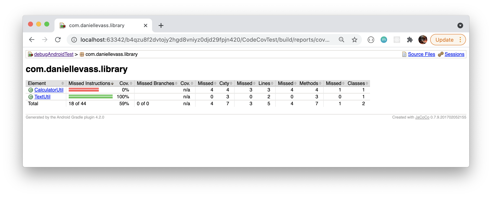

# android-code-coverage-example

This is a simple library project to demonstrate that unit test coverage reports are not generated.

I have two classes: CalculatorUtil and TextUtil.

CalculatorUtil has unit tests inside the `library/src/test` folder:

TextUtil has integration tests inside the `library/src/androidTest` folder.

I followed [this article from codecov to generate the report](https://about.codecov.io/blog/code-coverage-for-android-development-using-kotlin-jacoco-github-actions-and-codecov/).

When I run the task `./gradlew jacocoTestReport` it creates a report under `library/build/reports/coverage/debug/index.html` which displays the following:

However the unit tests are not included ☹️

Looking at [the codecov repo](https://codecov.io/gh/wise4rmgod/CodeCoverage_Example) you can see they also have the same issue, their `util/TextMethods` shows 0% coverage.

What do I need to fix to get a combined report with both androidTests and tests?
